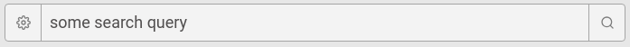

# fe-task

The goal of this task is to create a component which has two action buttons attached to the input field.  
Example to mimic:

Left (gear) icon should open a dropdown menu (it can be dummy dropdown, doesnt have to have actionable elements).  
Right (search) icon should trigger a query to any publicly available endpoint (ie, imdb is always a nice candidate, but it can really be anything that'll save you time or make it easier)

Search results fetched from endpoint can be dumped under the component.

Do this by utilizing the following:
- [Create React App](https://github.com/facebook/create-react-app) to bootstrap the project
- [reakit](https://reakit.io/) or [styled-components](https://www.styled-components.com/) to style your components. Styling doesnt have to be pixel perfect, but should be semantically correct
- Anything else you feel you need to complete the task. Ie, to quickly pull icons to the project, [react-icons](https://react-icons.netlify.com/#/icons/fi) are a nice choice.

What we'll be looking for in the solution is the design of the components interfaces, code readability, and general approach to the component creation.
